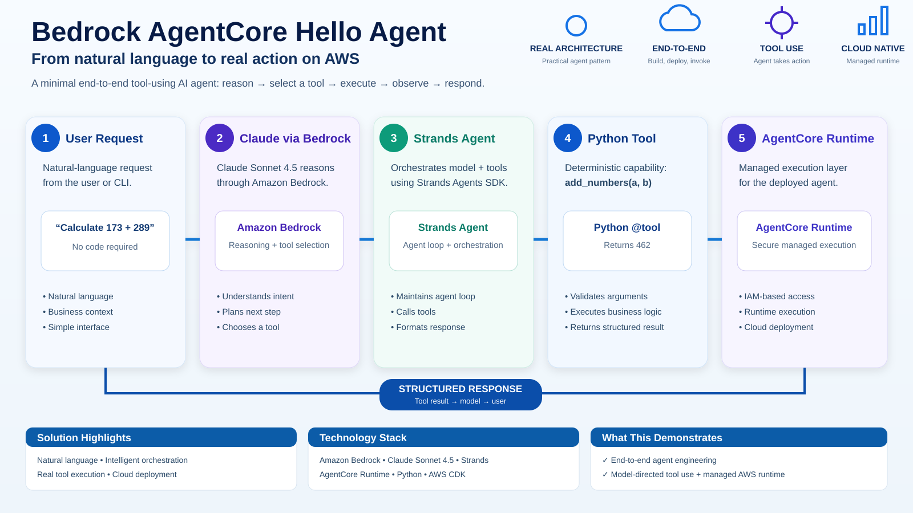

# Amazon Bedrock AgentCore — Hello Agent

A deliberately minimal, two-stage implementation of a **tool-using AI agent deployed on Amazon Bedrock AgentCore Runtime**. V1 demonstrates a local Python tool; V2 demonstrates external tool execution through **AgentCore Gateway, MCP, and AWS Lambda**.

The objective of this project is not to build a sophisticated application. It is to demonstrate, in the smallest practical example, the complete lifecycle of an AI agent:

**agent logic → model integration → tool selection → tool execution → local testing → AWS deployment → remote invocation**

## Exercise at a Glance



The infographic illustrates the original V1 execution path: a natural-language request is interpreted by Claude Sonnet through Amazon Bedrock, orchestrated by a Strands agent, executed through a controlled Python tool, and hosted in Amazon Bedrock AgentCore Runtime.

---

## Versions at a Glance

| Version | Tool execution | Primary lesson |
|---|---|---|
| **V1 — In-process Python tool** | `@tool add_numbers` inside the agent | Model-directed tool use and AgentCore Runtime deployment |
| **V2 — Gateway-mediated tool** (currently deployed) | Strands MCP client → AgentCore Gateway → AWS Lambda | Separation of agent orchestration from externally managed business capabilities |

Both versions use the same core agent, reasoning model, and managed Runtime. V2 updates the existing Runtime rather than creating a second one.

---

## What This Demo Does

The agent accepts natural-language requests and uses **Claude Sonnet 4.5 through Amazon Bedrock** as its reasoning model.

**In V1**, it also has access to a custom in-process Python tool:

```python
@tool
def add_numbers(a: int, b: int) -> int:
    """Return the sum of two numbers."""
    return a + b
```

When asked:

> Use your available tool to calculate 173 + 289.

the model determines that the `add_numbers` tool should be used, constructs the appropriate arguments, invokes the tool, observes the result, and generates the final response.

This demonstrates the fundamental agentic execution pattern:

```text
Reason
  ↓
Select Tool
  ↓
Construct Arguments
  ↓
Execute Tool
  ↓
Observe Result
  ↓
Respond
```

**In V2**, the calculator executes in AWS Lambda and is accessed through AgentCore Gateway using MCP. The calculator remains intentionally trivial: the point is the **agent architecture, access controls, and deployment lifecycle**, not the arithmetic.

---

## Architecture

### V1 — In-process tool (original implementation)

```text
                       User / CLI
                           │
                           │ agentcore invoke
                           ▼
              ┌─────────────────────────┐
              │ Amazon Bedrock          │
              │ AgentCore Runtime       │
              │                         │
              │ BedrockAgentCoreApp     │
              │          │              │
              │          ▼              │
              │     Strands Agent       │
              │       /       \         │
              │      /         \        │
              │     ▼           ▼       │
              │ add_numbers    Model    │
              │   tool        request   │
              └─────────────────┼───────┘
                                │
                                ▼
                         Amazon Bedrock
                                │
                                ▼
                       Claude Sonnet 4.5
```

### V2 — Gateway-mediated tool (current deployment)

```text
User / CLI
    |
    v
Amazon Bedrock AgentCore Runtime
    |
    v
Strands Agent <----> Amazon Bedrock / Claude Sonnet 4.5
    |
    v
MCPClient + SigV4 authentication
    |
    v
AgentCore Gateway (MCP endpoint)
    |
    v
Lambda target: add_numbers(a, b)
    |
    v
AWS Lambda: HelloAgentV2-AddNumbers
    |
    v
Result -> Strands Agent -> User
```

The Gateway provides the external tool interface; the Lambda function owns the deterministic business logic. The Runtime execution role receives narrowly scoped `bedrock-agentcore:InvokeGateway` permission, while Gateway-to-Lambda invocation is authorized separately. SigV4 signs Gateway requests with AWS credentials; no embedded access keys are required.

### Component Responsibilities

**Amazon Bedrock AgentCore Runtime**  
Provides the managed AWS runtime in which the agent executes.

**BedrockAgentCoreApp**  
Provides the runtime application harness and entrypoint used by AgentCore.

**Strands Agents SDK**  
Provides the agent framework responsible for orchestrating interactions between the model and available tools.

**Amazon Bedrock**  
Provides managed access to the foundation model using AWS identity and permissions.

**Claude Sonnet 4.5**  
Acts as the reasoning model that interprets requests and determines when an available tool should be used.

**Python Tool (V1)**  
`add_numbers` demonstrates in-process deterministic tool execution.

**AgentCore Gateway and MCP (V2)**  
Expose and discover the external `add_numbers` capability using an MCP client and Gateway target.

**AWS Lambda (V2)**  
Runs the calculator independently of the agent process.

**AWS IAM and SigV4 (V2)**  
Authenticate Gateway requests and authorize tool invocation using scoped permissions.

---

## Project Structure

```text
.
├── README.md
├── .gitignore
├── app/
│   └── HelloAgent/
│       ├── main.py
│       ├── gateway/
│       │   ├── auth.py
│       │   └── client.py
│       ├── model/
│       │   └── load.py
│       ├── pyproject.toml
│       └── uv.lock
│
├── gateway/
│   ├── iam/
│   ├── targets/add-numbers.json
│   └── test_gateway.py
├── lambda/add_numbers/
│   ├── handler.py
│   └── iam/
└── agentcore/
    ├── agentcore.json
    ├── aws-targets.example.json
    └── cdk/
```

Local deployment state, environment files, logs, caches, and AWS account-specific configuration are intentionally excluded from source control.

---

## Core Agent

### V1 — Local tool

The original tool is intentionally simple:

```python
@tool
def add_numbers(a: int, b: int) -> int:
    """Return the sum of two numbers."""
    return a + b
```

It is supplied to a Strands agent:

```python
Agent(
    model=load_model(),
    system_prompt=SYSTEM_PROMPT,
    tools=TOOLS,
    conversation_manager=NullConversationManager(),
)
```

### V2 — Discovered Gateway tools

The current agent uses `create_gateway_client()` from `app/HelloAgent/gateway/client.py`, opens its MCP connection, discovers tools through `list_tools_sync()`, and passes them to the Strands `Agent`. The Gateway URL is supplied through the required `AGENTCORE_GATEWAY_URL` environment variable. `app/HelloAgent/gateway/auth.py` implements SigV4 request signing.

The application reuses its Gateway client within the running process and maintains a bounded in-process session-to-agent cache. This is a learning implementation, not a fully hardened connection-management design.

The model is loaded from Amazon Bedrock:

```python
BedrockModel(
    model_id="global.anthropic.claude-sonnet-4-5-20250929-v1:0"
)
```

No direct Anthropic API key is used by this implementation. Model access is performed through Amazon Bedrock using AWS credentials and IAM authorization.

---

## AgentCore Runtime Entrypoint

AgentCore invokes the application through the runtime entrypoint:

```python
@app.entrypoint
async def invoke(payload, context):
    ...
```

The entrypoint validates the incoming prompt, obtains the agent associated with the runtime session, passes the prompt to the Strands agent, and streams agent events back through the AgentCore runtime interface.

The small in-process agent cache is **not durable AgentCore Memory**. It is intentionally lightweight and can reset when the runtime process restarts.

---

## Tool-Use Flow

The following describes the original V1 flow. In V2, the `add_numbers` execution step is replaced with **MCP client → AgentCore Gateway → Lambda**, and the result is returned to the agent for its final response.

A request such as:

```text
Use your available tool to calculate 173 + 289.
```

produces the following conceptual flow:

```text
User Request
     │
     ▼
Claude Sonnet 4.5
     │
     │ decides a tool is appropriate
     ▼
add_numbers
     │
     │ a = 173
     │ b = 289
     ▼
Python Execution
     │
     ▼
462
     │
     ▼
Tool Result returned to model
     │
     ▼
Final natural-language response
```

During local testing, the AgentCore inspector showed the tool invocation with:

```json
{
  "a": 173,
  "b": 289
}
```

and the tool result:

```json
[
  {
    "text": "462"
  }
]
```

This is the important behavior demonstrated by the project: the model is not limited to generating text; it can select and invoke a controlled application capability.

---

## Prerequisites

To reproduce the demo, you will need:

- An AWS account
- AWS CLI configured with appropriate credentials
- Permission to use Amazon Bedrock and AgentCore resources required by the project
- Access to the configured Bedrock model
- Python
- Node.js / npm
- Amazon Bedrock AgentCore CLI

AWS permissions should follow least-privilege principles for real environments.

---

## Running Locally

From the project root:

```bash
agentcore dev
```

The local AgentCore development interface can then be used to interact with and inspect the agent.

A useful test prompt is:

```text
Use your available tool to calculate 173 + 289.
```

The expected result is:

```text
The sum of 173 + 289 is 462.
```

For V1, the inspector can also verify that `add_numbers` was selected and executed. For V2, set `AGENTCORE_GATEWAY_URL` to your deployed Gateway MCP endpoint before running locally, and verify the Gateway-backed tool is selected. Gateway and Lambda resources must already exist and the caller must be authorized.

---

## Configuring an AWS Deployment Target

The real `agentcore/aws-targets.json` is intentionally excluded from source control because it contains deployment-specific AWS account information.

Create it from the sanitized example:

```bash
cp agentcore/aws-targets.example.json agentcore/aws-targets.json
```

Then replace `<YOUR_AWS_ACCOUNT_ID>` with the AWS account ID for the environment in which you intend to deploy.

---

## Deploying to AWS

**V2 deployment note:** The Lambda function, Gateway, Gateway target, and their IAM roles/policies were configured separately for this exercise; the CDK stack shown here manages the existing AgentCore Runtime, its Gateway endpoint environment variable, and the Runtime execution-role Gateway permission. Deploying this stack alone does **not** provision the external Gateway or Lambda resources. Configure those prerequisites first, and replace the exercise-specific Gateway URL and resource ARNs for your own account.

From the project root:

```bash
agentcore deploy
```

The project uses AWS CDK and CloudFormation as part of the deployment process.

Depending on the AWS environment, CDK may first require bootstrapping. Bootstrap infrastructure can include resources used to stage deployment assets, such as S3 and ECR resources and deployment roles.

---

## Invoking the Deployed Agent

After a successful deployment, invoke the agent remotely:

```bash
agentcore invoke "Explain what an API is in one sentence."
```

To demonstrate tool use:

```bash
agentcore invoke "Use your available tool to calculate 173 + 289."
```

Expected response:

```text
The sum of 173 + 289 is 462.
```

At this point the agent logic is executing in AWS rather than in the local development process.

---

## V2 — Verified End-to-End Deployment

The existing HelloAgent Runtime was updated in place through AWS CDK and CloudFormation. Following deployment, the Runtime reported **version 2** with status **READY**. A remote `invoke-agent-runtime` request instructed the agent to use the calculator to add 173 and 289. The streamed response showed invocation of the Gateway MCP tool `HelloAgentV2-CalculatorTarget___add_numbers` and the final answer **462**.

This validates the deployed path from user prompt through Strands, MCP, AgentCore Gateway, Lambda, and back to the user; it is more than a model-generated arithmetic answer.

### Example runtime invocation

Use your own Runtime ARN and a unique session identifier. With AWS CLI v2, `--cli-binary-format raw-in-base64-out` allows an inline JSON payload:

```bash
aws bedrock-agentcore invoke-agent-runtime \
  --agent-runtime-arn "$AGENT_RUNTIME_ARN" \
  --runtime-session-id "helloagent-v2-calculator-example-001" \
  --payload '{"prompt":"Use the calculator tool to add 173 and 289. What is the result?"}' \
  --cli-binary-format raw-in-base64-out \
  --content-type application/json \
  --accept application/json \
  --region us-east-1 \
  /tmp/helloagent-v2-response.json
```

The response file contains streamed events; inspect the tool-use event and the assembled text output to verify actual tool execution.

---

## Skills Demonstrated

| Area | Demonstrated Capability |
|---|---|
| Agentic AI | Model-directed tool selection and execution |
| Amazon Bedrock AgentCore | Agent deployment and managed runtime execution |
| Strands Agents SDK | Agent orchestration and tool integration |
| Model Context Protocol (MCP) | Tool discovery and remote tool invocation |
| AgentCore Gateway | Managed interface for external tools |
| AWS Lambda | Independently deployed deterministic calculator |
| AWS SigV4 | Signed requests to Gateway |
| Amazon Bedrock | Managed foundation-model inference |
| Claude | Natural-language reasoning and tool selection |
| Python | Agent logic and deterministic tool implementation |
| AWS IAM | Identity- and permission-based AWS access |
| AWS CDK | Infrastructure definition and deployment workflow |
| AWS CloudFormation | Infrastructure lifecycle management |
| Amazon ECR | CDK/deployment artifact infrastructure where applicable |
| Amazon S3 | CDK deployment artifact storage where applicable |
| AWS CLI | Authentication and AWS environment interaction |
| Observability / Debugging | Inspection of model and tool execution |
| Cloud Troubleshooting | Diagnosis of deployment and CDK bootstrap issues |

---

## Troubleshooting Experience From the Build

Building the demo also surfaced a useful real-world infrastructure scenario.

During deployment, the CDK bootstrap stack reported an ECR repository as an existing CloudFormation-managed resource even though the physical repository was no longer present. This caused AgentCore deployment to fail during CDK bootstrap.

The issue was isolated by comparing CloudFormation stack/resource state, the expected CDK bootstrap ECR repository, and the actual ECR registry state. The missing physical resource was restored and the deployment subsequently completed.

This reinforced an important cloud-engineering lesson:

> A successful infrastructure definition does not guarantee that the physical resources have remained consistent with the control-plane state. Deployment failures can require diagnosing infrastructure drift rather than changing application code.

---

## Why This Matters

The `add_numbers` function is deliberately trivial.

The important part is the architecture surrounding it.

The same pattern can expose enterprise capabilities such as:

```text
get_claim_status()
retrieve_policy()
check_vehicle_eligibility()
create_service_case()
query_inventory()
get_customer_history()
```

The architecture remains fundamentally similar:

```text
User Intent
     ↓
Foundation Model
     ↓
Tool Selection
     ↓
Controlled Enterprise Capability
     ↓
Result
     ↓
Model Response
```

This project therefore serves as a minimal reference implementation for understanding how an LLM moves from simply **generating text** to **reasoning over and invoking controlled application capabilities**.

---

## What This Demo Intentionally Does Not Include

To keep the architecture easy to understand, the current V2 implementation does not implement:

- AgentCore Memory
- A self-hosted MCP server (V2 uses managed AgentCore Gateway)
- Retrieval-Augmented Generation (RAG)
- Knowledge Bases
- Multi-agent orchestration
- AgentCore Browser
- AgentCore Code Interpreter
- Production end-user authentication flows
- Durable conversation history

These capabilities can be layered onto the same core architecture as requirements evolve.

---

## Security Notes

The deployed AgentCore Runtime is not intended to provide anonymous public access.

AWS authorization controls which principals can invoke deployed resources. Production implementations should apply least-privilege IAM permissions and appropriate authentication and authorization controls.

This repository intentionally excludes:

- AWS credentials
- local environment files
- AgentCore deployment state
- AWS account-specific target configuration
- local logs and caches
- the original local Git-history backup

Never commit AWS access keys, session credentials, tokens, or other secrets to source control.

---

## Cost Characteristics

This demo is designed as a small serverless learning workload.

The primary variable costs arise when the agent is invoked, including foundation-model inference and runtime consumption. Small amounts of storage may also be associated with deployment artifacts.

Actual AWS charges depend on region, usage, model pricing, runtime behavior, and the resources present in the AWS account. Consult current AWS pricing before using this architecture for sustained workloads.

---

## Key Takeaway

A useful mental model for the project is:

```text
Claude          = reasoning
Strands         = agent orchestration
Python tools    = in-process capabilities (V1)
MCP + Gateway   = external tool access (V2)
AWS Lambda      = separately deployed business logic (V2)
Bedrock         = managed model access
AgentCore       = managed agent runtime
CDK             = infrastructure deployment
```

Together, these components demonstrate the basic foundation of a tool-using agentic application on AWS.

---

## Next Evolution

With V2's Gateway-mediated calculator validated, a logical next step is replacing or extending it with a tool that retrieves information the model cannot know independently.

For example:

```python
@tool
def get_claim_status(claim_id: str) -> str:
    ...
```

That evolves the demo from:

**reason → calculate → respond**

to:

**reason → retrieve enterprise data → observe → respond**

This is the foundation for substantially more useful enterprise agents.
